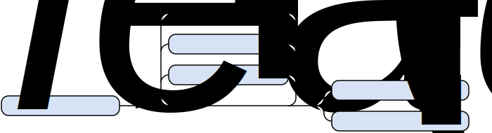

////
Distributed under the Boost Software License, Version 1.0.

See accompanying file LICENSE_1_0.txt or copy at
http://www.boost.org/LICENSE_1_0.txt
////

= The Strf formatting library - Quit Reference
:source-highlighter: prettify
:sectnums:
:sectnumlevels: 2
:toc: left
:toclevels: 2

[[usage_syntax]]
== Main usage syntax

.Example
[source,cpp]
----
#include <strf.hpp>
#include <cassert>

std::string sample()
{
    int x = 100;

    std::string str =
        strf::to_string // the destination
        .reserve(100)   // The reserved capacity in the created string
        .with(strf::monotonic_grouping<10>{3}) // numeric punctuation
        .tr("{0} times {0} is equal to {1}", x, x*x);

    assert(str.capacity() >= 100);
    assert(str == "100 times 100 is equal to 10,000");
}
----

[[destinations]]
=== Destinations

////
[%header,cols=2*]
|===
| Destination       | Return type
| `to_string`      | `std::string`
| `to_u16string`   | `std::u16string`
| `to_u326string`  | `std::u32string`
| `to_wstring`     | `std::wstring`
| `to_basic_string<CharT, Traits, Alloc>`  | `std::basic_string<CharT, Traits, Alloc>`
| `append(std::basic_string<CharT, Traits, Alloc>&)`  | `void`
| `assign(std::basic_string<CharT, Traits, Alloc>&)`  | `void`

| `to(CharT* str, std::size)`
| `struct /{asterisk}{asterisk}/ { CharT* ptr; bool truncated; }`

| `to(CharT* begin, CharT* end)`
| `struct /{asterisk}{asterisk}/ { CharT* ptr; bool truncated; }`

| `to(CharT (&)[N])`
| `struct /{asterisk}{asterisk}/ { CharT* ptr; bool truncated; }`

| `to(FILE*)`
| `struct /{asterisk}{asterisk}/ { std::size_t count; bool truncated; }`

| `wto(FILE*)`
| `struct /{asterisk}{asterisk}/ { std::size_t count; bool truncated; }`

| `to(std::basic_streambuf<CharT, Traits, Alloc>&)`
| `struct /{asterisk}{asterisk}/ { std::streamsize count; bool truncated; }`

|
|===
Where `CharT` can be `char`, `char8_t`, `char16_t`, `char32_t` or `wchar_t`.
////

The "destination" is what defines the effect and also the return type of the main usage syntax, as listed below:

[source,cpp,subs=normal]
----
constexpr /{asterisk}\...{asterisk}/ to_string;
----
::
[horizontal]
Effect::: Creates a string object
Return type::: `std::string`

[source,cpp,subs=normal]
----
constexpr /{asterisk}\...{asterisk}/ to_u16string;
----
::
[horizontal]
Effect::: Creates a string object
Return type::: `std::u16string`

[source,cpp,subs=normal]
----
constexpr /{asterisk}\...{asterisk}/ to_u32string;
----
::
[horizontal]
Effect::: Creates a string object
Return type::: `std::u32string`
Support reserve::: Yes.

[source,cpp,subs=normal]
----
constexpr /{asterisk}\...{asterisk}/ to_wstring;
----
::
[horizontal]
Effect::: Creates a string object
Return type::: `std::wstring`
Support reserve::: Yes.

[source,cpp,subs=normal]
----
template <typename CharT, typename Traits, typename Alloc>
constexpr /{asterisk}\...{asterisk}/ to_basic_string;
----
::
[horizontal]
Effect::: Creates a string object
Return type::: `std::basic_string<CharT, Traits, Alloc>`
Support reserve::: Yes.

[source,cpp,subs=normal]
----
template <typename CharT, typename Traits, typename Alloc>
/{asterisk}\...{asterisk}/ append (std::basic_string<CharT, Traits, Alloc>& str);
----
::
[horizontal]
Effect::: Appends the generated content to `str`
Return type::: `void`
Support reserve::: Yes. The effect is to call `str.reserve(std.size() + size)`, where `size` is the value passed to `reserve` function in the main usage syntax or the calculated content's size when `reserve_calc` is used.

[source,cpp,subs=normal]
----
template <typename CharT, typename Traits, typename Alloc>
/{asterisk}\...{asterisk}/ assign (std::basic_string<CharT, Traits, Alloc>& str);
----
::
[horizontal]
Effect::: Assign `str` to the generated content.
Return type::: `void`
Support reserve::: Yes.

[source,cpp,subs=normal]
----
/{asterisk}\...{asterisk}/ to ( char*     dest, std::size_t count );
/{asterisk}\...{asterisk}/ to ( char8_t*  dest, std::size_t count );
/{asterisk}\...{asterisk}/ to ( char16_t* dest, std::size_t count );
/{asterisk}\...{asterisk}/ to ( char32_t* dest, std::size_t count );
/{asterisk}\...{asterisk}/ to ( wchar_t*  dest, std::size_t count );
----
::
[horizontal]
Requirements::: `count > 0`
Effect:::
- Write the generated content to `dest`.
- Write no more than `count` characters including the termination character.
- The terminations character is always written.
Return type::: `struct /{asterisk}\...{asterisk}/ { std::decltype(dest) ptr; bool truncated; };`
Return value:::
- `ptr` points to the last written position. Hence `*ptr` is always equal to `'\0'`
- `truncated` is equal to `true` when `count` is smaller than the content's size.

[source,cpp,subs=normal]
----
/{asterisk}\...{asterisk}/ to ( char*     dest, char*     dest_end );
/{asterisk}\...{asterisk}/ to ( char8_t*  dest, char8_t*  dest_end );
/{asterisk}\...{asterisk}/ to ( char16_t* dest, char16_t* dest_end );
/{asterisk}\...{asterisk}/ to ( char32_t* dest, char32_t* dest_end );
/{asterisk}\...{asterisk}/ to ( wchar_t*  dest, wchar_t*  dest_end );
----
::
[horizontal]
Requirements::: `dest_end > dest`
Effect::: Same as in `to(dest, dest_end - dest)`
Return type::: Same as in `to(dest, dest_end - dest)`
Return value::: Same as in `to(dest, dest_end - dest)`
Support reserve::: No

[source,cpp,subs=normal]
----
template<std::size_t N> /{asterisk}\...{asterisk}/ to ( char     (&dest)[N] );
template<std::size_t N> /{asterisk}\...{asterisk}/ to ( char8_t  (&dest)[N] );
template<std::size_t N> /{asterisk}\...{asterisk}/ to ( char16_t (&dest)[N] );
template<std::size_t N> /{asterisk}\...{asterisk}/ to ( char32_t (&dest)[N] );
template<std::size_t N> /{asterisk}\...{asterisk}/ to ( wchar_t  (&dest)[N] );
----
::
[horizontal]
Effect::: Same as in `to(dest, N)`
Return type::: Same as in `to(dest, N)`
Return value::: Same as in `to(dest, N)`
Support reserve::: No

[source,cpp,subs=normal]
----
template <typename CharT = char>
/{asterisk}\...{asterisk}/ to(std::FILE* dest);
----
::
[horizontal]
Effect::: Successively call
`std::fwrite(buffer, sizeof(CharT),/{asterisk}\...{asterisk} , dest)`
until the whole content is written or until an error happens, where `buffer` is
an internal array of `CharT`.
Return type::: `struct /{asterisk}\...{asterisk}/ { std::size_t count; bool success; };`
Return value:::
- `count` is sum of the returned values returned by the several calls to `std::fwrite`.
- `success` is `false` if an error occured.
Support reserve::: No

[source,cpp,subs=normal]
----
/{asterisk}\...{asterisk}/ wto(std::FILE* dest);
----
::
[horizontal]
Effect::: Successively call `std::fputwc(/{asterisk}\...{asterisk}/, dest)`
until the whole content is written or until it returns `WEOF`.
Return type::: `struct /{asterisk}\...{asterisk}/ { std::size_t count; bool success; };`
Return value:::
- `count` is sum of the returned values returned by the several calls to `std::fwrite`.
- `success` is `false` if an error occured.
Support reserve::: No

[source,cpp]
----
template <typename CharT, typename Traits = std::char_traits<CharT> >
/*...*/ to(std::basic_streambuf<CharT, Traits>& dest);
----
::
[horizontal]
Effect::: Successively call `dest.sputn(/{asterisk}\...{asterisk}/)`
until the whole content is written or until an error occur.
Return type::: `struct /{asterisk}\...{asterisk}/ { std::streambuf count; bool success; };`
Return value:::
- `count` is sum of the returned values returned by the several calls to `dest.sputn(/{asterisk}\...{asterisk}/)`
- `success` is `false` if an error occured.
Support reserve::: No

[[reserve]]
=== Reserving
The `reserve` and `reserve_calc` are only supported in some destination types, as indicated above.

* `reserve(std::size_t count)` : The size of `count` characters is reserve in the destination object.
* `reserve_calc()` : The necessary amount of characters is calculated and reserved in the destination object.
* `no_reserve()` : No size is reserved in the destination object.

[[tr_string]]
=== Tr-string

The __tr-string__ is what in other formatting
libraries would be called as the __format string__,
with the difference that it does not specify any formatting.
Its purpose is to enable the use of translation tools like
https://en.wikipedia.org/wiki/Gettext[gettext].

[source,cpp]
----
auto s = strf::to_string.tr("{} in hexadecimal is {}", x, strf::hex(x));
----

==== Syntax
[%header,cols=3*]
|===
|A `'{'` followed by  |until                           |means
|`'-'`                |the next `'}'` or end of string |a comment
|a digit              |the next `'}'` or end of string |a positional argument reference
|another `'{'`        |the second `'{'`                |an escaped `'{'`
|any other character  |the next `'}'` or end of string |a non positional argument reference
|===

===== Comments

When the tr-string has to be translated to other languages, the translation may be in charge of someone else than you. So you can add comments intended to help such person.
[source,cpp]
----
auto str = strf::to_string.tr
    ( "You can learn more about python{-the programming language, not the reptile} at {}"
    , "www.python.org" );
assert(str == "You can learn more about python at www.python.org");
----

===== Positional arguments
Position zero refers to the first input argument. The characters the after the digits are ignored. So they can also be used as comments.
[source,cpp]
----
auto str = strf::to_string.tr("{1 a person} likes {0 a food type}.", "sandwich", "Paul");
assert(str == "Paul likes sandwich.");
----

===== Non positional arguments
The characters the after the `'{'` are ignored as well
[source,cpp]
----
auto str = strf::to_string.tr("{a person} likes {a food type}.", "Paul", "sandwich");
assert(str == "Paul likes sandwich.");
----

===== Escapes
There is no way to escape the `'}'` character. There is no need to, since the `'}'` has special meaning only if it corresponds to a previous `'{'
[source,cpp]
----
auto str = strf::to_string.tr("} {{ } {}", "aaa");
assert(str == "} { } aaa");
----

[[tr_string_error]]
==== Tr-string error handling
The enumeration `tr_invalid_arg` is a <<facets,facet>> that specifies what happens when the tr-string references a non existing argument.
[source,cpp]
----
enum class tr_invalid_arg{ replace, stop, ignore };
----
* `tr_invalid_arg::stop` : Throws an exception.
* `tr_invalid_arg::ignore` : Ignores the invalid reference.
* `tr_invalid_arg::replace` :  Replaces the invalid reference by the https://en.wikipedia.org/wiki/Specials_(Unicode_block)#Replacement_character[replacement character &#xFFFD;]. This is the default.

[[facets]]
=== Facets

These are not the same as the facets handled by `std::locale`,
but they are analogous.
Keep in mind that this is a locale-independent library.
So things are always printed as in the C-locale, unless
you explicitly specify otherwise, which you do by passing
__facet objects__ to the `<<usage_syntax,with>>` function.

Every __facet__ belongs to a __facet category__.
Each facet category corresponds to a concept, __i.e.__ a set of requirements that a class must satisfy. A class that satisfies such requirements is a facet of such facet category. Moreover, for each facet category there is class whose name, by convention, has a "_c" suffix and is the name of the category.

For example, `<<numpunct,monotonic_grouping>><10>` and
`<<numpunct,str_grouping>><10>`  are both facets of the category
`<<numpunct,numpunct_c>><10>`.
Both have the same purpose: to customize numeric punctuation.

[%header,cols="2,1,4"]
|===
|Category |Constrainable |What it controls

|`<<width_calculation,width_calculation_c>>` |Yes |How the width is calculated
|`<<numpunct, numpunct_c>><10>`      |Yes |Numeric punctuation for decimal base
|`<<numpunct, numpunct_c>><16>`      |Yes |Numeric punctuation for hexadecimal base
|`<<numpunct, numpunct_c>><8>`       |Yes |Numeric punctuation for octal base
|`<<numpunct, numpunct_c>><2>`       |Yes |Numeric punctuation for binary base

|`<<lettercase,lettercase_c>>`        |Yes |Letter case in numeric types

|`<<encoding,encoding_c>><CharT>`   |No  |The encoding correponding to character type `CharT`
|`<<encoding_error,encoding_error_c>>`    |Yes |Encoding error handling
|`<<surrogates_policy,surrogates_policy_c>>` |Yes |Wheter surrogates are treated as errors
|`<<tr_string_error,tr_string_error_c>>`   |No  |Tr-string parsing error handling
|===

[[constrained_facets]]
==== Constrained facets

With the `constrain` function template you can create __constrained facets__, which are facets that only apply to certain input types. Its template parameter is a template type that contains a `value` member constexpr convertible to bool that tells whether a given input type is under the influence of the given facet:

[source,cpp]
----
auto facet_obj = strf::constrain<std::is_signed>(strf::monotonic_grouping<10>{3});
auto s = strf::to_string.with(facet_obj)(100000u, "  ", 100000);
assert(s == "100000  100,000");
----

The library provides some type traits to parameterize `constrain`:

[cols="1,4"]
|===
|`is_int_number`
| matches `short`, `int`, `long`, `long long` and the corresponding unsigned types

|`is_char`
| matches `char`, `char8_t`, `wchar_t`, `char16_t`, and `char32_t`

|`is_string`
| matches strings.
|===

[[facet_overriding]]
==== Overriding facets

If there are two or more facets object passed to the `with` function of the same category, and that apply to the same input type, then the last one wins:

[source,cpp]
----
auto punct_dec_1 = strf::monotonic_grouping<10>{1};
auto punct_dec_2 = strf::monotonic_grouping<10>{2}.thousands_sep('.');
auto punct_dec_3 = strf::monotonic_grouping<10>{3}.thousands_sep('^');;

// Below, punct_dec_3 overrides punct_dec_2, but only for signed types.
// punct_dec_2 overrides punct_dec_1 for all input types,
// hence the presence of punt_dec_1 bellow has no effect.

auto s = strf::to_string
    .with( punct_dec_1
         , punct_dec_2
         , strf::constrain<std::is_signed>(punct_dec_3) )
    ( 100000, "  ", 100000u ) ;

assert(s == "100^000  10.00.00");
----

[[numpunct]]
== Numeric punctuation
The facets of the `numpunct_c<Base>` category specify
the decimal point, the group separator character, and the groups'
size when printing numbers in the numeric base `Base`.
The library currently provides two
facets belonging to this category for you to choose.
If all groups have the same size, then you should choose the
`monotonic_grouping<Base>` facet since it is optimized for this situation:

[source,cpp]
----
constexpr int base = 10;

auto str = strf::to_string
    .with(strf::monotonic_grouping<base>{3}.thousands_sep(U'.'))
    (100000000000ll);

assert(str == "100.000.000.000");
----

Otherwise, you can use the `str_grouping<Base>`:

[source,cpp]
----
constexpr int base = 10;

auto punct = strf::str_grouping<base>{"\4\3\2"};
auto str = strf::to_string.with(punct)(100000000000ll);
assert(str == "1,00,00,000,0000");
----

[[lettercase]]
== Letter case

The `lettercase` facets affect the letter cases when printing numeric values.
The default value is `strf::lowercase`.

[source,cpp]
----
namespace strf {

enum class lettercase { lower = /*...*/, mixed = /*...*/, upper = /*...*/ };

constexpr lettercase lowercase = lettercase::lower;
constexpr lettercase mixedcase = lettercase::mixed;
constexpr lettercase uppercase = lettercase::upper;

}
----

.Printed numeric values examples
[%header,cols="1,2"]
|===
|Value | Result examples

|`strf::lowercase`
|`0xab` `1e+50` `inf` `nan`

|`strf::mixedcase`
|`0xAB` `1e+50` `Inf` `NaN`

|`strf::uppercase`
|`0XAB` `1E+50` `INF` `NAN`
|===

.Usage example
[source,cpp]
----
auto str_upper = strf::to_string.with(strf::uppercase)
    ( ~strf::hex(0xabc), ' '
    , 1.0e+50, ' '
    , std::numeric_limits<FloatT>::infinity() );

assert(str_upper == "0XAB 1E+50 INF");

auto str_mixed = strf::to_string.with(strf::mixedcase)
    ( ~strf::hex(0xabc), ' '
    , 1.e+50, ' '
    , std::numeric_limits<FloatT>::infinity() );

assert(str_upper == "0xAB 1e+50 Inf");
----

[[encoding]]
== Character encodings

=== Class template `encoding`

The `encoding` class template stores a reference to an const object
with static storage duration of an implementation-defined type that
contains information and algorithms related to a character encoding.
It has the size of a pointer, and it is cheap to copy.

[source,cpp]
----
namespace strf {

template <typename CharT>
class encoding
{
public:
    encoding (const encoding&) noexcept;
    encoding& operator=(const encoding&);
    bool operator==(const encoding&);
    const char* name() const; // example: "UTF-8"

    // other functions ( to-do ) ...
};

} // namespace strf
----

So an `encoding` object is used to represent an econding.
When used as a facet, `encoding<CharT>` specifies what is the character
encoding corresponding to `CharT`. For example, you may have noticed that
<<numpunct,punctuation characters>> and fill characters are specified
as `char32_t`. They are aways assumed to be in UTF-32.
How they are converted is specified that the `encoding` facet.

.Example: write in Windows-1252
[source,cpp]
----
auto s = strf::to_string
    .with(strf::windows_1252<char>())
    .with(strf::str_grouping<10>{"\4\3\2"}.thousands_sep(0x2022))
    ("one hundred billions = ", 100000000000ll);

// The character U+2022 is encoded as '\225' in Windows-1252
assert(s == "one hundred billions = 1\2250000\225000\2250000");
----

=== Supported encodings

Currently the library only provide few encodings. But list is expected
to grow:

[source,cpp]
----
template<typename CharT> encoding<CharT> utf8();
----
::
[horizontal]
Requirements::: `sizeof(CharT) == 1`
Return::: The UTF-8 encoding
Note::: This is the default facet for `char` and `char8_t`

[source,cpp]
----
template<typename CharT> encoding<CharT> iso_8859_1();
----
::
[horizontal]
Requirements::: `sizeof(CharT) == 1`
Return::: The https://en.wikipedia.org/wiki/ISO/IEC_8859-1[ISO/IEC 8859-1] encoding

[source,cpp]
----
template<typename CharT> encoding<CharT> iso_8859_1();
----
::
[horizontal]
Requirements::: `sizeof(CharT) == 1`
Return::: The https://en.wikipedia.org/wiki/ISO/IEC_8859-1[ISO/IEC 8859-1] encoding

[source,cpp]
----
template<typename CharT> encoding<CharT> iso_8859_15();
----
::
[horizontal]
Requirements::: `sizeof(CharT) == 1`
Return::: The https://en.wikipedia.org/wiki/ISO/IEC_8859-15[ISO/IEC 8859-15] encoding

[source,cpp]
----
template<typename CharT> encoding<CharT> windows_1252();
----
::
[horizontal]
Requirements::: `sizeof(CharT) == 1`
Return::: The https://en.wikipedia.org/wiki/Windows-1252[Windows-1252] encoding

[source,cpp]
----
template<typename CharT> encoding<CharT> utf16()`;
----
::
[horizontal]
Requirements::: `sizeof(CharT) == 2`
Return::: The UTF-16 encoding.
Note::: This is the default for `char16_t`.

[source,cpp]
----
template<typename CharT> encoding<CharT> utf32();
----
::
[horizontal]
Requirements::: `sizeof(CharT) == 4`
Return::: UTF-32 encoding.
Note::: This is the default for `char32_t`.

[source,cpp]
----
encoding<wchar_t> utfw();
----
::
[horizontal]
Returns::: UTF-16 if `sizeof(wchar_t) == 2` and UTF-32 if `sizeof(wchar_t) == 4`
Note::: This is the default for `wchar_t`.

[[encoding_conversion]]
=== Encoding conversion

Since the library knows the encoding correspondig to each
character type, and knows how to convert from one to another,
it is possible to mix input string of difference characters
types. It is necessary though to use the `cv` function:

[source,cpp]
----
auto str   = strf::to_string( "aaa-"
                            , strf::cv(u"bbb-")
                            , strf::cv(U"ccc-")
                            , strf::cv(L"ddd") );

auto str16 = strf::to_u16string( strf::cv("aaa-")
                               , u"bbb-"
                               , strf::cv(U"ccc-")
                               , strf::cv(L"ddd") );

assert(str   ==  "aaa-bbb-ccc-ddd");
assert(str16 == u"aaa-bbb-ccc-ddd");
----

The `cv` function can also specify an alternative encoding
for a specific input string argument:

[source,cpp]
----
auto str_utf8 = strf::to_u8string
    ( strf::cv("--\xA4--", strf::iso_8859_1<char>())
    , strf::cv("--\xA4--", strf::iso_8859_15<char>()));

assert(str_utf8 == u8"--\u00A4----\u20AC--");
----

There is also the `sani` function that was the same
effect as `cv` except when the input encoding is same as the
output. In this case `sani` causes the input to be
sanitized, whereas `cv` does not:

[source, cpp]
----
auto str = strf::to_string
    .with(strf::iso_8859_3<char>()) // the output encoding
    ( strf::cv("--\xff--")                           // does't sanitize
    , strf::cv("--\xff--", strf::iso_8859_3<char>()) // does't sanitize ( same encoding )
    , strf::cv("--\xff--", strf::utf8<char>())       // sanitizes ( different encoding )
    , strf::sani("--\xff--")                             // sanitizes
    , strf::sani("--\xff--", strf::iso_8859_3<char>()) ) // sanitizes  

assert(str == "--\xff----\xff----?----?----?--");
----

[[encoding_error]]
=== Encoding error handling

The `encoding_error` enumeration controls how invalid
sequences are handled during encoding conversion.
[source,cpp]
----
namespace strf {
enum class encoding_error{ replace, stop };
}
----
The default value is `encoding_error::replace`, that
causes the invalid sequence to be replaced the
https://en.wikipedia.org/wiki/Specials_(Unicode_block)#Replacement_character[replacement character &#xFFFD;]. When the input is UTF-8,
the library follows the practice recommended by the Unicode
Standard ( search for "Best Practices for Using U+FFFD" in
https://www.unicode.org/versions/Unicode10.0.0/ch03.pdf[Chapter 3] ).

.Replace
[source,cpp]
----
auto str = strf::to_u8string (strf::cv("--\x99--"));
assert(str == u8"--\uFFFD--");
----

.Throw exception
[source,cpp]
----
bool transcoding_failed = false;
try{
    auto str = strf::to_string
        .with(strf::encoding_error::stop)
        (strf::cv("--\x99--"));
}
catch(strf::encoding_failure&){
    transcoding_failed = true;
}
assert(transcoding_failed);
----

[[surrogates_policy]]
=== Surrogates tolerance

The `surrogate_policy` enumeration is a facet that controls
whether surrogates are tolerated.

[source,cpp]
----
namespace strf {
enum class surrogate_policy : bool { strict = false, lax = true };
}
----

The default value is `surrogate_policy::strict`.

[source,cpp]
----
std::u16string input_utf16 {u"-----"};
input_utf16[1] = 0xD800; // a surrogate character alone

// convert to UTF-8
auto str_strict = strf::to_u8string(strf::cv(input_utf16));
auto str_lax = strf::to_u8string
    .with(strf::surrogate_policy::lax)
    ( strf::cv(input_utf16) );

assert(str_strict == u8"-\uFFFD---");  // surrogate sanitized
assert(str_lax == (const char8_t*)"-\xED\xA0\x80---"); // surrogate allowed

// Then back to UTF-16
auto utf16_strict = strf::to_u16string(strf::cv(str_lax));

auto utf16_lax = strf::to_u16string
    .with(strf::surrogate_policy::lax)
    ( strf::cv(str_lax) );

assert(utf16_strict == u"-\uFFFD\uFFFD\uFFFD---"); // surrogate sanitized
assert(utf16_lax == input_utf16);                  // surrogate preserved
----

[[width_calculation]]
== Width Calculation

to-do

[[format_functions]]
== Format functions

[source,cpp]
----
namespace strf {

template <typename T>
constexpr /*...*/ fmt(const T& value);

}
----

`fmt(value)` returns an object that contains a copy or reference of
`value` as well as format information and what is called here as
__format functions__. These are member functions whose return type
-- which is usually but not always the same as of `fmt(value)` --
also contains the same format functions. This way, you can call
several of them in a row like
`fmt(value).func1(/{asterisk}\...{asterisk}/).func2(/{asterisk}\...{asterisk}/).func3(/{asterisk}\...{asterisk}/)`. What format functions are available depends on the
type of `value`, so you need to check them in the further section
<<input_types, "Input types">>. But there is a set of format functions
that is common is most input types, which are related to alignment
(__a.k.a__ justification):

[[alignment_format_functions]]
[horizontal]
.Text aligment format function
`operator>(std::int16_t width)`::: Align to the right ( Or to the left right-to-left (RTL) script )
`operator<(std::int16_t width)`::: Align to the left ( Or to the right right-to-left (RTL) script )
`operator^(std::int16_t width)`::: Center alignment
`operator%(std::int16_t width)`::: Split the content, like in `std::internal`.
`fill(char32_t ch)`::: Set the fill character.

There are also some global functions that act as syntatic sugar
for format functions:

include::ref_global_format_functions.adoc[]

[[input_types]]
== Input types

=== Integers

Types::
`short`,
`int`,
`long int`,
`long long int`,
`unsigned short`,
`unsigned int`,
`unsigned long int` and
`unsigned long long int`

Format functions::
( in addition to <<alignment_format_functions, alignment functions>> )
`dec()`::: Use decimal base ( This is already the default, though )
`hex()`::: Use hexadecimal base.
`oct()`::: Use octal base.
`bin()`::: Use binary base.
`p(unsigned precision)`::: Ensures that at least `precision` digits
are printed by adding extra zero leading digits if necessary.
`operator+()`::: When in decimal base, print the positive sign
`"+"` when value is non negative. No effect for other bases.
`operator~()`::: Print the base indication
( `"0x"` for hexadecimal, `"0"` for octal and `"0b"` for binary ).
No effect in decimal base.

=== Floating Points
Types::
`float`, `double`

Format functions::
( In addition to the <<alignment_format_functions, alignment functions>> )
`operator+()`::: When in decimal base, print the positive sign
`"+"` when value is non negative. No effect for other bases.
`operator~()`:::  Prints the decimal point even when there
are no fractional digits.
`sci()`::: Use scientific notation, like this: `"1.2345e+02"`.
`fixed()`::: Use decimanl notation, like this: `"123.45"`.
`gen()`::: This is the default notation.
 When precision is unspecified ( or equal to `(unsigned)-1` )
 prints in the scientfic notation if, and only if, it is shorter
 than the fixed notation. Otherwise, does like in `std::printf`:
 uses the scientfic notation if the exponent is less than -4 or greater
 than or equal to the precision. Trailing fractional zeros are not printed.
`p(unsigned precision)`::: If `precision == (unsigned)-1`, which is
the default, then prints the minimal amount of digits so that value
can fully recovered by a parser. Otherwise, if notation is __general__,
`precision` is the number of significant digits. Otherwise it is
the number of fractional digits. `precision == 0` has the same effect as
`precision == 1`.

=== Single characters
Type:: `CharT`, that is the output character type defined by the <<destinations,destination>>.

Format functions::
( in addition to <<alignment_format_functions, alignment functions>> )
`multi(std::size_t count)`::: Prints the character `count` times. Default value is `1`.

=== Strings
Types::
`const CharT*`, `std::string_view<CharT, Traits>`
and `std::basic_string<CharT, Traits, Alloc>`
::
where:
::
- `CharT` is the character type. If it is not the same as the output character type ( defined by the <<destinations,destination>> ), then it is necessare to use the `cv` or `sani` format function.
- `Traits` can be any type that satisfies https://en.cppreference.com/w/cpp/named_req/CharTraits[CharTraits]
- `Alloc` can be any type that satisfies https://en.cppreference.com/w/cpp/named_req/Allocator[Allocator]

Format functions::
( in addition to <<alignment_format_functions, alignment functions>> )
`sani(encoding<CharT> enc)`::: Translates input string from `enc` to the
                               output encoding. If the encodings are the same
                               then sanitizes the input string.
`sani()`::: Translates input string from the encoding associated to `CharT` to
            the output encoding. If these encodings are the same
            then sanitizes the input string.
`cv(encoding<CharT> enc)`::: Translates input string from `enc` to the
                             output encoding, if these encodings are not the same.
                             Otherwise, copies input string as it is.
`cv()`::: Translates input string from the encoding associated to `CharT` to
          the output encoding, if these encodings are not the same.
          Otherwise, copies the input string as it is.

.Example
[source,cpp]
----
auto str = strf::to_string(strf::center(u" Hello! ", 16, '*').cv());
assert(str == "**** Hello! ****");
----

See also the section about <<encoding_conversion,encoding conversion>>.

=== Ranges

==== Without formatting

[source,cpp]
----
namespace strf {

template <typename Range>
/*...*/ range(const Range& r);

template <typename T, std::size_t N>
/*...*/ range(T (&array)[N]);

template <typename Iterator>
/*...*/ range(const Iterator& begin, const Iterator& end);

// With separator:

template <typename Range, typename CharT>
/*...*/ separated_range(const Range& r, const CharT* separator);

template <typename T, std::size_t N, typename CharT>
/*...*/ separated_range(T (&array)[N], const CharT* separator);

template <typename Iterator, typename CharT>
/*...*/ separated_range( const Iterator& begin
                       , const Iterator& end
                       , const CharT* separator );

} // namespace strf
----

.Example
[source,cpp]
----
std::vector<int> vec = { 11, 22, 33 };
auto str = strf::to_string("[", strf::separated_range(vec, ", "), "]");
assert(str == "[11, 22, 33]");
----

==== With formatting

[source,cpp]
----
namespace strf {

template <typename Range>
/*...*/ fmt_range(const Range& r);

template <typename T, std::size_t N>
/*...*/ fmt_range(T (&array)[N], const Range& r);

template <typename Iterator>
/*...*/ fmt_range(const Iterator& begin, const Iterator& end);

// With separator:

template <typename Range, typename CharT>
/*...*/ fmt_separated_range(const Range& r, const CharT* separator);

template <typename T, std::size_t N, typename CharT>
/*...*/ fmt_separated_range(T (&array)[N], const CharT* separator);

template <typename Iterator, typename CharT>
/*...*/ fmt_separated_range( const Iterator& begin
                           , const Iterator& end
                           , const CharT* separator );

} // namespace strf
----
Any format function applicable to the element type of the
range can also be applied to the
expression `strf::fmt_range(/{asterisk}\...{asterisk}/)` or
`strf::fmt_separated_range(/{asterisk}\...{asterisk}/)`.
This way the format functions is applied to all elements:

.Example 1
[source,cpp]
----
std::vector<int> vec = { 11, 22, 33 };
auto str1 = strf::to_string("[", +strf::fmt_separated_range(vec, " ;") > 4, "]");
assert(str1 == "[ +11 ; +22 ; +33]");
----

.Example 2
[source,cpp]
----
std::vector<int> vec = { 11, 22, 33 };
auto str2 = strf::to_string
    ( "["
    , ~strf::fmt_separated_range(vec, " / ").fill('.').hex() > 6,
    " ]");

assert(str2 == "[..0xfa / ..0xfb / ..0xfc]");
----

=== Joins

==== Without alignment

[source,cpp]
----
namespace strf {

template <typename ... Args>
/*...*/ join(const Args& ... args);

}
----
The `join` function template enables you group a set of input
arguments as if they were one.

.Example
[source,cpp]
----
std::string host_name = "isocpp.org";
unsigned char ip_addr [4] = {104, 236, 162, 70};

auto str = strf::to_string .tr
    ( "The IP address of {} is {}."
    , host_name
    , strf::join(ip_addr[0], '.', ip_addr[1], '.', ip_addr[2], '.', ip_addr[3]));

assert(str == "The IP address of isocpp.org is 104.236.162.70.");
----

==== With alignment

The return type of `join(args ...)` provides the
<<alignment_format_functions,alignment format functions>>.
You can use them to align a join:

[source,cpp]
----
auto str = strf::to_string
    ("---", strf::join("abc", "def", 123) > 15, "---");

assert(str == "---      abcdef123---");
----

The `split_pos` function specifies how many arguments
go before the fill when the `operator%` is used.
[source,cpp]
----
str = strf::to_string
    ( strf::join('a', 'b', 'c', 'd', 'e', 'f').split_pos(2) % 10 );
assert(str == "ab    cdef");
----

The functions below provide an alternartive syntax to create aligned
join. Their return type has the `operator()(const Args& ... args)` member function
that receives the elements of the join.

[source,cpp]
----
namespace strf {

enum class text_alignment {left, right, split, center};

/* ... */ join_align( std::int16_t width
                    , text_alignment align
                    , char32_t fillchar = U' '
                    , std::ptrdiff_t split_pos = 0 );
/* ... */ join_center(int width, char32_t fillchar = U' ');
/* ... */ join_left(int width, char32_t fillchar = U' ');
/* ... */ join_right(int width, char32_t fillchar = U' ');
/* ... */ join_split(int width, int split_pos);
/* ... */ join_split( std::int16_t width
                    , char32_t fillchar
                    , std::ptrdiff_t split_pos );
}
----

.Example
[source,cpp]
----
auto str = strf::to_string
    ("---", strf::join_right(15) ("abc", "def", 123), "---");
assert(str == "---      abcdef123---");

str = strf::to_string
    ("---", strf::join_center(15) ("abc", "def", 123), "---");
assert(str == "---   abcdef123   ---");

str = strf::to_string
    ( "---"
    , strf::join_left(15, U'.') ("abc", strf::right("def", 5), 123)
    , "---" );
assert(str == "---abc  def123....---");

str = strf::to_string
    ( "---"
    , strf::join_split(15, '.', 1) (strf::left("abc", 5), "def", 123)
    , "---" );
assert(str == "---abc  ....def123---");
----

=== Facets
You can <<facet_overriding,override facets>> to a
subset of the input arguments.

[source,cpp]
----
namespace strf {

template < typename FPack >
class inner_pack
{
    template <typename... Args>
    /*...*/  operator()(const Args& \... args) const;

    //...
};

template <typename ... Facets>
inner_pack</*...*/> with(const Facets& ... facets);
----
.Example 1
[source,cpp]
----
auto str = strf::to_string.with(strf::monotonic_grouping<10>(1))
    ( 10000
    , "  "
    , strf::hex(0x10000)
    , strf::with( strf::monotonic_grouping<10>(3)
                , strf::monotonic_grouping<16>(4).thousands_sep('\'') )
        ( "  { "
        , 10000
        , "  "
        , strf::hex(0x10000)
        , " }" ) );

assert(str == "1,0,0,0,0  10000  { 10,000  1'0000 }");
----

.Example 2
[source,cpp]
----
auto fp = strf::pack
    ( strf::monotonic_grouping<10>(3)
    , strf::monotonic_grouping<16>(4).thousands_sep('\'') );

auto str = strf::to_string.with(strf::monotonic_grouping<10>(1))
    ( 10000
    , "  "
    , strf::hex(0x10000)
    , strf::with(fp)
        ( "  { "
        , 10000
        , "  "
        , strf::hex(0x10000)
        , strf::with
            (strf::monotonic_grouping<10>(2).thousands_sep('.'))
              ("  { ", 10000, " }")
        , " }" ) );

assert(str == "1,0,0,0,0  10000  { 10,000  1'0000  { 1.00.00 } }");
----

== Extending the library

=== Adding output types
to-do

=== Adding input typess
to-do

=== Adding Facets
to-do

=== Adding encodings
to-do
