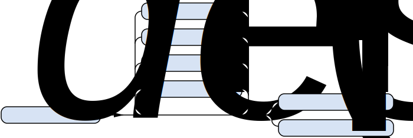

////
Copyright (C) (See commit logs on github.com/robhz786/strf)
Distributed under the Boost Software License, Version 1.0.
(See accompanying file LICENSE_1_0.txt or copy at
http://www.boost.org/LICENSE_1_0.txt)
////

:printer_type: <<printer_type,printer_type>>
:printer: <<printer,printer>>
:tag: <<tag,tag>>
:print_preview: <<print_preview,print_preview>>
:make_printer_input: <<make_printer_input,make_printer_input>>

:basic_cstr_writer: <<outbuff_hpp#basic_cstr_writer,basic_cstr_writer>>
:basic_char_array_writer: <<outbuff_hpp#basic_char_array_writer,basic_char_array_writer>>
:destination_no_reserve: <<destination,destination_no_reserve>>
:OutbuffCreator: <<OutbuffCreator,OutbuffCreator>>
:SizedOutbuffCreator: <<SizedOutbuffCreator,SizedOutbuffCreator>>

[[destination]]
== Destinations

The `destination_no_reserve`, `destination_reserve_calc` and
`destination_with_given_size` class templates implement the
basic usage syntax of the library:

////
All of them contain a {facets_pack} member object in addition to
__{OutbuffCreator}__ or __{SizeOutbuffCreator}__ member object and
in the above expression:
////

* `no_reserve()` always returns a `destination_no_reserve` object
* `reserve_calc()` always returns a `destination_reserve_calc` object.
* `reserve(__size__)` always returns a `destination_with_given_size` object.
* The __destination__ is an expression whose type is an instance of one
those three class templates.

=== Destination makers

====
[[to_char_ptr_range]]
[source,cpp,subs=normal]
----
namespace strf {

__/{asterisk} see below {asterisk}/__ to(char8_t{asterisk}  dest,  char8_t{asterisk}  end);
__/{asterisk} see below {asterisk}/__ to(char{asterisk}     dest,  char{asterisk}     end);
__/{asterisk} see below {asterisk}/__ to(char16_t{asterisk} dest,  char16_t{asterisk} end);
__/{asterisk} see below {asterisk}/__ to(char32_t{asterisk} dest,  char32_t{asterisk} end);
__/{asterisk} see below {asterisk}/__ to(wchar_t{asterisk}  dest,  wchar_t{asterisk}  end);

} // namespace strf
----
[horizontal]
[horizontal]
Return type:: `{destination_no_reserve}<OBC>`, where `OBC` is an implementation-defined
              type that satifies __{OutbuffCreator}__.
Return value:: A destination object whose internal __{OutbuffCreator}__ object `obc`
is such that `obc.create()` returns a `{basic_cstr_writer}<CharT>` object initialized
with `dest` and `dest_end`, where, `CharT` is `std::remove_reference_t<decltype(*dest)>`.
====

[[to_char_ptr_count]]
====
[source,cpp,subs=normal]
----
namespace strf {

__/{asterisk} see below {asterisk}/__ to(char8_t{asterisk}  dest, std::size_t count);
__/{asterisk} see below {asterisk}/__ to(char{asterisk}     dest, std::size_t count);
__/{asterisk} see below {asterisk}/__ to(char16_t{asterisk} dest, std::size_t count);
__/{asterisk} see below {asterisk}/__ to(char32_t{asterisk} dest, std::size_t count);
__/{asterisk} see below {asterisk}/__ to(wchar_t{asterisk}  dest, std::size_t count);

} // namespace strf
----

[horizontal]
Return type and value:: Same as of `to(dest, dest + count)`;
====
====
[[to_char_array]]
[source,cpp,subs=normal]
----
namespace strf {

template<std::size_t N> __/{asterisk} see below {asterisk}/__ to(char8_t  (&dest)[N]);
template<std::size_t N> __/{asterisk} see below {asterisk}/__ to(char     (&dest)[N]);
template<std::size_t N> __/{asterisk} see below {asterisk}/__ to(char16_t (&dest)[N]);
template<std::size_t N> __/{asterisk} see below {asterisk}/__ to(char32_t (&dest)[N]);
template<std::size_t N> __/{asterisk} see below {asterisk}/__ to(wchar_t  (&dest)[N]);

} // namespace strf
----
[horizontal]
Return type and value:: Same as of `to(dest, dest + N)`;
====

[[to_range]]
====
[source,cpp,subs=normal]
----
namespace strf {
template <typename CharT>
__/{asterisk} see below {asterisk}/__ to_range(CharT* dest, CharT* dest_end);

} // namespace strf
----
[horizontal]
[horizontal]
Return type:: `{destination_no_reserve}<OBC>`, where `OBC` is an implementation-defined
              type that satifies __{OutbuffCreator}__.
Return value:: A destination object whose internal __{OutbuffCreator}__ object `obc`
is such that `obc.create()` returns a `{basic_char_array_writer}<CharT>` object initialized
with `dest` and `dest_end`.
====
[[to_range_array]]
====
[source,cpp,subs=normal]
----
namespace strf {
template <typename CharT, std::size_t N>
__/{asterisk} see below {asterisk}/__ to_range(CharT (&dest)[N]);

} // namespace strf
----
[horizontal]
Return type and value:: Same as of `to_range(dest, dest + N)`;
====
[[to_range_count]]
====
[source,cpp,subs=normal]
----
namespace strf {
template <typename CharT>
__/{asterisk} see below {asterisk}/__ to_range(CharT* dest, std::size_t count);

} // namespace strf
----
[horizontal]
Return type and value:: Same as of `to_range(dest, dest + count)`;
====

[[destination_no_reserve]]
=== Class template `destination_no_reserve`
====
[source,cpp,subs=normal]
----
template <typename OutbuffCreator, typename FPack = {facets_pack}<>>
class destination_no_reserve
----
Compile-time requirements::
- `FPack` is an instance of <<facets_pack,`facets_pack`>>.
- `OutbuffCreator` satisfies <<OutbuffCreator,_OutbuffCreator_>>.
====
==== Synopsis
[source,cpp,subs=normal]
----
namespace strf {

template <typename OutbuffCreator, typename FPack>
class destination_no_reserve
{
public:
    using char_type = typename OutbuffCreator::char_type;

    // <<destination_no_reserve_ctor,constructors>>
    template <typename\... Args>
    constexpr destination_no_reserve(Args&&\...);
    constexpr destination_no_reserve(const destination_no_reserve&);
    constexpr destination_no_reserve(destination_no_reserve&&);

    // <<destination_no_reserve_with,facets>>
    template <typename\... FPE>
    destination_no_reserve<OutbuffCreator, /{asterisk}\...{asterisk}/> with(FPE&&\...) const &;

    template <typename\... FPE>
    destination_no_reserve<OutbuffCreator, /{asterisk}\...{asterisk}/> with(FPE&&\...) &&;

    // <<destination_no_reserve_reserve,size reserve>>
    constexpr destination_calc_size<OutbuffCreator, FPack>
    reserve_calc() const &;

    constexpr destination_calc_size<OutbuffCreator, FPack>
    reserve_calc() &&;

    constexpr destination_with_given_size<OutbuffCreator, FPack>
    reserve(std::size_t) const &;

    constexpr destination_with_given_size<OutbuffCreator, FPack>
    reserve(std::size_t) &&;

    constexpr destination_no_reserve&  no_reserve() &;
    constexpr destination_no_reserve&& no_reserve() &&;
    constexpr const destination_no_reserve&  no_reserve() const &;
    constexpr const destination_no_reserve&& no_reserve() const &&;

    // <<destination_no_reserve_printing,printing>>
    template <typename\... Args>
    /{asterisk}\...{asterisk}/ operator()(const Args&\...) const;

    template <typename\... Args>
    /{asterisk}\...{asterisk}/ tr(const char_type*, const Args&\...) const;

    template <typename\... Args>
    /{asterisk}\...{asterisk}/ tr( const std::basic_string_view<char_type>&
              , const Args&\...) const;

    template <typename\... Args>
    /{asterisk}\...{asterisk}/ tr( std::basic_string_view<char_type>
              , const Args&\...) const;

private:
    OutbuffCreator &#95;outbuff_creator; // exposition only
    FPack &#95;fpack;                    // exposition only
};

} // namespace strf
----

==== Public member functions

[[destination_no_reserve_ctor]]
===== Constructors
====
[source,cpp]
----
template <typename... Args>
constexpr destination_no_reserve(Args&&... args);
----
Compile-time requirements::
- `FPack` is https://en.cppreference.com/w/cpp/named_req/DefaultConstructible[_DefaultConstructible_]
- `std::is_constructible<OutbuffCreator, Args\...>` is `true`, otherwise this constructor does not participate on overload resolution.
Effect::
- Initializes `_outbuff_creator` with `std::forward<Args>(args)\...`.
====
====
[source,cpp]
----
constexpr destination_no_reserve(const destination_no_reserve&) = default;
----
Copy constructor.

Compile-time requirements::
- `FPack` and `OutbuffCreator` are
   https://en.cppreference.com/w/cpp/named_req/CopyConstructible[_CopyConstructible_]
====
====
[source,cpp]
----
constexpr destination_no_reserve(destination_no_reserve&&) = default;
----
Move constructor.
====
[[destination_no_reserve_with]]
===== Facets
====
[source,cpp,subs=normal]
----
template <typename\... FPE>
/{asterisk} see below {asterisk}/ with(FPE&&\...) const &;
----
Compile-time requirements::
- All types in `FPE\...` satisfy <<FacetsPackElement, _FacetsPackElement_>>.
- `OutbuffCreator` is https://en.cppreference.com/w/cpp/named_req/CopyConstructible[_CopyConstructible_]
Return Type::
+
[source,cpp,subs=normal]
----
destination_no_reserve< OutbuffCreator
                      , decltype(<<pack,pack>>( std::declval<const FPack&>()
                                     , std::forward<FPE>(fpe)\...) ) >
----
Effect:: Creates a `destination_no_reserve` object whose `_outbuff_creator`
is initialized with this `_outbuff_creator`, and whose `_fpack` is initialized
with `pack(this\->_fpack, std::forward<FPE>(fpe)\...)`
====
====
[source,cpp,subs=normal]
----
template <typename\... FPE>
/{asterisk} see below {asterisk}/ with(FPE&&\...) &&;
----
Compile-time requirements::
- All types in `FPE\...` satisfy <<FacetsPackElement, _FacetsPackElement_>>.
- `OutbuffCreator` is https://en.cppreference.com/w/cpp/named_req/MoveConstructible[_MoveConstructible_]
Return Type::
+
[source,cpp,subs=normal]
----
destination_no_reserve< OutbuffCreator
                      , decltype(<<pack,pack>>( std::declval<const FPack&>()
                                     , std::forward<FPE>(fpe)\...) ) >
----
Effect:: Creates an `destination_no_reserve` object whose `_outbuff_creator`
is initialized with `std::move(_outbuff_creator)`, and whose `_fpack` is
initialized with `pack(std::move(this\->_fpack), std::forward<FPE>(fpe)\...)`
====
[[destination_no_reserve_reserve]]
===== Size reserve
====
[source,cpp,subs=normal]
----
constexpr destination_calc_size<OutbuffCreator, FPack> reserve_calc() const &;
----
Compile-time requirements::
- `OutbuffCreator` is https://en.cppreference.com/w/cpp/named_req/CopyConstructible[_CopyConstructible_]
   and <<SizedOutbuffCreator,_SizedOutbuffCreator_>>.
- `FPack` is https://en.cppreference.com/w/cpp/named_req/CopyConstructible[_CopyConstructible_].
Effect:: Creates an `destination_calc_size` object whose `_outbuff_creator`
is initialized with this `_outbuff_creator`, and whose `_fpack` is
initialized with this `_fpack`.
====
====
[source,cpp,subs=normal]
----
constexpr destination_calc_size<OutbuffCreator, FPack> reserve_calc() &&;
----
Compile-time requirements::
- `OutbuffCreator` is https://en.cppreference.com/w/cpp/named_req/MoveConstructible[_MoveConstructible_]
   and <<SizedOutbuffCreator,_SizedOutbuffCreator_>>.
- `FPack` is https://en.cppreference.com/w/cpp/named_req/CopyConstructible[_CopyConstructible_].
Effect:: Creates an `destination_calc_size` object whose `_outbuff_creator`
is initialized with `std::move(_outbuff_creator)` from this object, and whose `_fpack` object is
initialized with `std::move(_fpack)` from this object.
====
====
[source,cpp,subs=normal]
----
constexpr destination_with_given_size<OutbuffCreator, FPack>
reserve(std::size_t size) const &;
----
Compile-time requirements::
- `OutbuffCreator` is https://en.cppreference.com/w/cpp/named_req/CopyConstructible[_CopyConstructible_]
   and <<SizedOutbuffCreator,_SizedOutbuffCreator_>>.
- `FPack` is https://en.cppreference.com/w/cpp/named_req/CopyConstructible[_CopyConstructible_].
Effect:: Creates an `destination_with_given_size` whose `_size` is initialized with `size`,
whose `_outbuff_creator` is initialized with this `_outbuff_creator`, and whose `_fpack` is
initialized with this `_fpack`.
====
====
[source,cpp,subs=normal]
----
constexpr destination_with_given_size<OutbuffCreator, FPack>
reserve(std::size_t size) &&;
----
Compile-time requirements::
`OutbuffCreator` is https://en.cppreference.com/w/cpp/named_req/MoveConstructible[_MoveConstructible_]
   and <<SizedOutbuffCreator,_SizedOutbuffCreator_>>.
- `FPack` is https://en.cppreference.com/w/cpp/named_req/CopyConstructible[_CopyConstructible_].
Effect:: Creates an `destination_with_given_size` object whose `_size` is initialized with `size`,
whose `_outbuff_creator` is initialized with `std::move(_outbuff_creator)  from this object,
and whose `_fpack` is initialized with `std::move(_fpack)` from this object.
====
====
[source,cpp,subs=normal]
----
constexpr destination_no_reserve&  no_reserve() &;
constexpr destination_no_reserve&& no_reserve() &&;
constexpr const destination_no_reserve&  no_reserve() const &;
constexpr const destination_no_reserve&& no_reserve() const &&;
----
[horizontal]
Effect:: None.
Return:: This object.
====

[[destination_no_reserve_printing]]
===== Printing
====
[source,cpp,subs=normal]
----
template <typename\... Args>
/{asterisk}\...{asterisk}/ operator()(const Args&\... args) const;
----
Compile-time requirements::
- All types in `Args\...` are <<Printable,_Printable_>>.
// Return type::
// - `decltype(std::declval<decltype(_outbuff_creator.create())&>().finish())` if such type is valid, otherwise `void`
Effect::
. Creates the <<ourbuff_hpp#basic_outbuff,outbuff>> object doing
+
[source,cpp,subs=normal]
----
typename OutbuffCreator::outbuff_type ob{_outbuff_creator.create()};
----
. For each `arg` in `args\...`, does
+
[source,cpp,subs=normal]
----
using preview_type = {print_preview}<preview_size::no, preview_width::no>;
preview_type preview;
using printer_type = {printer_type}<char_type, preview_type, FPack, Arg>;
printer_type p{ {make_printer_input}<char_type>(preview, &#95;fpack, arg) };
static_cast<const {printer}<char_type>&>(p).print_to(ob);
----
where `Arg` is the type in `Args\...` corresponding to `arg`
. Returns `ob.finish()` if such expression is valid, which is optional.
  Otherwise the return type is `void`.
====
[[destination_no_reserve_tr]]
====
[source,cpp,subs=normal]
----
template <typename ... Args>
/{asterisk}\...{asterisk}/ tr( const char_type* tr_string
          , const Args&\... args) const;

template <typename ... Args>
/{asterisk}\...{asterisk}/ tr( const std::basic_string_view<char_type>& tr_string
          , const Args&\... args) const;

template <typename ... Args>
/{asterisk}\...{asterisk}/ tr( std::basic_string_view<char_type> tr_string
          , const Args&\... args) const;
----
Compile-time requirements::
- All types in `Args\...` are <<Printable,_Printable_>>.
Effect:: __to-do__

////
. Creates/get the <<ourbuff_hpp#basic_outbuff,outbuff>> object doing
+
[source,cpp,subs=normal]
----
typename OutbuffCreator::outbuff_type ob{_outbuff_creator.create()};
----
. For each `arg` in `args\...`, creates a printer object by doing:
+
[source,cpp,subs=normal]
----
----
, where `Arg` is the type in `Args\...` corresponding to `arg`
. Prints into `ob` the content according the <<tr_string,tr-string syntax>>
  and using the `p` objects.
. Returns `ob.finish()` if such expression is valid, which is optional.
  Otherwise the return type is `void`.
////

====
[[destination_calc_size]]
=== Class template `destination_calc_size`
====
[source,cpp,subs=normal]
----
template <typename SizedOutbuffCreator, typename FPack = {facets_pack}<>>
class destination_calc_size;
----
Compile-time requirements::
- `FPack` is an instance of <<facets_pack,`facets_pack`>>.
- `SizedOutbuffCreator` satisfies <<SizedOutbuffCreator,_SizedOutbuffCreator_>>.
====
==== Synopsis
[source,cpp,subs=normal]
----
namespace strf {

template <typename SizedOutbuffCreator, typename FPack>
class destination_reserve_calc
{
public:
    using char_type = typename SizedOutbuffCreator::char_type;

    // <<destination_reserve_calc_ctor,constructors>>
    template <typename\... Args>
    constexpr destination_reserve_calc(Args&&\...);

    constexpr destination_reserve_calc(const destination_reserve_calc&) = default;
    constexpr destination_reserve_calc(destination_reserve_calc&&) = default;

    // <<destination_reserve_calc_with,facets>>
    template <typename\... FPE>
    destination_reserve_calc<SizedOutbuffCreator, /{asterisk}\...{asterisk}/> with(FPE&&\...) const &;

    template <typename\... FPE>
    destination_reserve_calc<SizedOutbuffCreator, /{asterisk}\...{asterisk}/> with(FPE&&\...) &&;

    // <<destination_reserve_calc_reserve,size reserve>>
    constexpr destination_no_reserve<SizedOutbuffCreator, FPack>
    no_reserve() const &;

    constexpr destination_no_reserve<SizedOutbuffCreator, FPack>
    no_reserve() &&;

    constexpr destination_with_given_size<SizedOutbuffCreator, FPack>
    reserve(std::size_t) const &;

    constexpr destination_with_given_size<SizedOutbuffCreator, FPack>
    reserve(std::size_t) &&;

    constexpr destination_reserve_calc&  reserve_calc() &;
    constexpr destination_reserve_calc&& reserve_calc() &&;
    constexpr const destination_reserve_calc&  reserve_calc() const &;
    constexpr const destination_reserve_calc&& reserve_calc() const &&;

    // <<destination_reserve_calc_printing,printing>>
    template <typename\... Args>
    /{asterisk}\...{asterisk}/ operator()(const Args&\...) const;

    template <typename\... Args>
    /{asterisk}\...{asterisk}/ tr(const char_type*, const Args&\...) const;

    template <typename\... Args>
    /{asterisk}\...{asterisk}/ tr(const std::basic_string<char_type>&, const Args&\...) const;

    template <typename\... Args>
    /{asterisk}\...{asterisk}/ tr(std::basic_string_view<char_type>, const Args&\...) const;

private:
    OutbuffCreator _outbuff_creator; // exposition only
    FPack _fpack;                    // exposition only
};

} // namespace strf
----

[[destination_reserve_calc_ctor]]
===== Constructors
====
[source,cpp]
----
template <typename... Args>
constexpr destination_reserve_calc(Args&&... args);
----
Compile-time requirements::
- `FPack` is https://en.cppreference.com/w/cpp/named_req/DefaultConstructible[_DefaultConstructible_]
- `std::is_constructible<OutbuffCreator, Args\...>::value` is `true`, otherwise this constructor does not participate on overload resolution.
Effect::
- Initializes `_outbuff_creator` with `std::forward<Args>(args)\...`.
====
====
[source,cpp]
----
constexpr destination_reserve_calc(const destination_reserve_calc&) = default;
----
Copy constructor.

Compile-time requirements::
- `FPack` and `OutbuffCreator` are
   https://en.cppreference.com/w/cpp/named_req/CopyConstructible[_CopyConstructible_]
====
====
[source,cpp]
----
constexpr destination_reserve_calc(destination_reserve_calc&&) = default;
----
Move constructor.
====
[[destination_reserve_calc_with]]
===== Facets
====
[source,cpp,subs=normal]
----
template <typename\... FPE>
/{asterisk} see below {asterisk}/ with(FPE&&\...) const &;
----
Compile-time requirements::
- All types in `FPE\...` satisfy <<FacetsPackElement, _FacetsPackElement_>>.
- `OutbuffCreator` is https://en.cppreference.com/w/cpp/named_req/CopyConstructible[_CopyConstructible_]
Return Type::
+
[source,cpp,subs=normal]
----
destination_reserve_calc< OutbuffCreator
                        , decltype(<<pack,pack>>( std::declval<const FPack&>()
                                       , std::forward<FPE>(fpe)\...) ) >
----
Effect:: Creates an `destination_reserve_calc` object whose `_outbuff_creator`
is initialized with this `_outbuff_creator`, and whose `_fpack` is initialized
with `pack(this\->_fpack, std::forward<FPE>(fpe)\...)`
====
====
[source,cpp,subs=normal]
----
template <typename\... FPE>
/{asterisk} see below {asterisk}/ with(FPE&&\...) &&;
----
Compile-time requirements::
- All types in `FPE\...` satisfy <<FacetsPackElement, _FacetsPackElement_>>.
- `OutbuffCreator` is https://en.cppreference.com/w/cpp/named_req/MoveConstructible[_MoveConstructible_]
Return Type::
+
[source,cpp,subs=normal]
----
destination_reserve_calc< OutbuffCreator
                        , decltype(<<pack,pack>>( std::declval<const FPack&>()
                                       , std::forward<FPE>(fpe)\...) ) >
----
Effect:: Creates an `destination_reserve_calc` object whose `_outbuff_creator`
is initialized with `std::move(this\->_outbuff_creator)`, and whose `_fpack` is
initialized with `pack(std::move(this\->_fpack), std::forward<FPE>(fpe)\...)`
====
[[destination_reserve_calc_reserve]]
===== Size reserve
====
[source,cpp,subs=normal]
----
constexpr destination_no_reserve<OutbuffCreator, FPack> no_reserve() const &;
----
Compile-time requirements::
- `OutbuffCreator` is https://en.cppreference.com/w/cpp/named_req/CopyConstructible[_CopyConstructible_]
- `FPack` is https://en.cppreference.com/w/cpp/named_req/CopyConstructible[_CopyConstructible_].
Effect:: Creates an `destination_no_reserve` object whose `_outbuff_creator`
is initialized with this `_outbuff_creator`, and whose `_fpack` is
initialized with this `_fpack`.
====
====
[source,cpp,subs=normal]
----
constexpr destination_calc_size<OutbuffCreator, FPack> reserve_calc() &&;
----
Compile-time requirements::
- `OutbuffCreator` is https://en.cppreference.com/w/cpp/named_req/MoveConstructible[_MoveConstructible_]
- `FPack` is https://en.cppreference.com/w/cpp/named_req/CopyConstructible[_CopyConstructible_].
Effect:: Creates an `destination_no_reserve` object whose `_outbuff_creator`
is initialized with `std::move(_outbuff_creator)` from this object, and whose `_fpack` object is
initialized with `std::move(_fpack)` from this object.
====
====
[source,cpp,subs=normal]
----
constexpr destination_with_given_size<OutbuffCreator, FPack>
reserve(std::size_t size) const &;
----
Compile-time requirements::
- `OutbuffCreator` is https://en.cppreference.com/w/cpp/named_req/CopyConstructible[_CopyConstructible_]
   and <<SizedOutbuffCreator,_SizedOutbuffCreator_>>.
- `FPack` is https://en.cppreference.com/w/cpp/named_req/CopyConstructible[_CopyConstructible_].
Effect:: Creates an `destination_with_given_size` whose `_size` is initialized with `size`,
whose `_outbuff_creator` is initialized with this `_outbuff_creator`, and whose `_fpack` is
initialized with this `_fpack`.
====
====
[source,cpp,subs=normal]
----
constexpr destination_with_given_size<OutbuffCreator, FPack>
reserve(std::size_t) &&;
----
Compile-time requirements::
`OutbuffCreator` is https://en.cppreference.com/w/cpp/named_req/MoveConstructible[_MoveConstructible_]
   and <<SizedOutbuffCreator,_SizedOutbuffCreator_>>.
- `FPack` is https://en.cppreference.com/w/cpp/named_req/CopyConstructible[_CopyConstructible_].
Effect:: Creates an `destination_with_given_size` object whose `_size` is initialized with `size`,
whose `_outbuff_creator` is initialized with `std::move(_outbuff_creator)  from this object,
and whose `_fpack` is initialized with `std::move(_fpack)` from this object.
====
====
[source,cpp,subs=normal]
----
constexpr destination_reserve_calc&  reserve_calc() &;
constexpr destination_reserve_calc&& reserve_calc() &&;
constexpr const destination_reserve_calc&  reserve_calc() const &;
constexpr const destination_reserve_calc&& reserve_calc() const &&;
----
[horizontal]
Effect:: None.
Return:: This object.
====
[[destination_reserve_calc_printing]]
===== Printing
====
[source,cpp,subs=normal]
----
template <typename\... Args>
/{asterisk}\...{asterisk}/ operator()(const Args&\... args) const;
----
Compile-time requirements::
- All types in `Args\...` are <<Printable,_Printable_>>.
Effect::
. Creates an object `preview` of type
  `{print_preview}<preview_size::yes, preview_width::no>`.
+
[source,cpp,subs=normal]
----
using preview_type = {print_preview}<preview_size::yes, preview_width::no>;
preview_type preview;
----
. For each `arg` in `args\...`, creates a printer object by doing:
+
[source,cpp,subs=normal]
----
using printer_type = {printer_type}<char_type, preview_type, FPack, Arg>;
printer_type p{ {make_printer_input}<char_type>(preview, &#95;fpack, arg) };
----
. Creates/get the <<ourbuff_hpp#basic_outbuff,outbuff>> object doing
+
[source,cpp,subs=normal]
----
using ob_type = typename OutbuffCreator::size_outbuf_type;
ob_type ob{_outbuff_creator.create(preview.<<size_preview_accumulated_size,accumulated_size>>())};
----
. For each `p` object does:
+
[source,cpp,subs=normal]
----
static_cast<const {printer}<char_type>&>(p).print_to(ob);
----
. Returns `ob.finish()` if such expression is valid, which is optional. Otherwise the return type is `void`.
====
====
[source,cpp,subs=normal]
----
template <typename ... Args>
/{asterisk}\...{asterisk}/ tr( const char_type* tr_string
          , const Args&\... args) const;

template <typename ... Args>
/{asterisk}\...{asterisk}/ tr( const std::basic_string_view<char_type>& tr_string
          , const Args&\... args) const;

template <typename ... Args>
/{asterisk}\...{asterisk}/ tr( std::basic_string_view<char_type> tr_string
          , const Args&\... args) const;
----
Compile-time requirements::
- All types in `Args\...` are <<Printable,_Printable_>>.
Effect:: __to-do__

////
. For each `arg` in `args\...`, do
+
[source,cpp,subs=normal]
----
print_preview<preview_size::yes, preview_width::no> preview;
auto p = static_cast< const {printer}<CharT>& >
    ( {printer_type}<CharT, FPack, T>{ fpack, preview, x, {tag}<CharT>{} } )
----
. Calculates the size of the content to be printed according to the
  <<tr_string,tr-string syntax>> and using the `preview` objects
  of the previous step.
. Creates/get the <<ourbuff_hpp#basic_outbuff,outbuff>> object by doing
+
[source,cpp,subs=normal]
----
decltype(auto) ob = _outbuff_creator.create(size)
----
, where `size` is the value calculated in the previous step.
. Prints into `ob` the content according the <<tr_string,tr-string syntax>>
  and using the `p` objects.
. Returns `ob.finish()` if such expression is valid, which is optional.
  Otherwise the return type is `void`.
////
====

[[destination_with_given_size]]
=== Class template `destination_with_given_size`
====
[source,cpp,subs=normal]
----
template <typename SizedOutbuffCreator, typename FPack = {facets_pack}<>>
class destination_with_given_size
----
Compile-time requirements::
- `FPack` is an instance of <<facets_pack,`facets_pack`>>.
- `SizedOutbuffCreator` satisfies <<SizedOutbuffCreator,_SizedOutbuffCreator_>>.
====
==== Synopsis
[source,cpp,subs=normal]
----
namespace strf {

template <typename SizedOutbuffCreator, typename FPack>
class destination_with_given_size
{
public:
    using char_type = typename SizedOutbuffCreator::char_type;

    // <<destination_with_given_size_ctor,constructors>>
    template <typename\... Args>
    constexpr destination_with_given_size(std::size_t, Args&&\...);
    constexpr destination_with_given_size(const destination_with_given_size&) = default;
    constexpr destination_with_given_size(destination_with_given_size&&) = default;

    // <<destination_with_given_size_with,facets>>
    template <typename\... FPE>
    destination_with_given_size<SizedOutbuffCreator, /{asterisk}\...{asterisk}/> with(FPE&&\...) const &;

    template <typename\... FPE>
    destination_with_given_size<SizedOutbuffCreator, /{asterisk}\...{asterisk}/> with(FPE&&\...) &&;

    // <<destination_with_given_size_reserve,size reserve>>
    constexpr destination_calc_size<SizedOutbuffCreator, FPack>
    reserve_calc() const &;

    constexpr destination_calc_size<SizedOutbuffCreator, FPack>
    reserve_calc() &&;

    constexpr destination_no_reserve<SizedOutbuffCreator, FPack>
    no_reserve() const &;

    constexpr destination_no_reserve<SizedOutbuffCreator, FPack>
    no_reserve() &&;

    constexpr destination_with_given_size&  reserve(std::size_t) &;
    constexpr destination_with_given_size&& reserve(std::size_t) &&;
    constexpr destination_with_given_size   reserve(std::size_t) const &;
    constexpr destination_with_given_size   reserve(std::size_t) const &&;

    // <<destination_with_given_size_printing,printing>>
    template <typename\... Args>
    /{asterisk}\...{asterisk}/ operator()(const Args&\...) const;

    template <typename\... Args>
    /{asterisk}\...{asterisk}/ tr(const char_type*, const Args&\...) const;

    template <typename\... Args>
    /{asterisk}\...{asterisk}/ tr(const std::basic_string<char_type>&, const Args&\...) const;

    template <typename\... Args>
    /{asterisk}\...{asterisk}/ tr(std::basic_string_view<char_type>, const Args&\...) const;

private:
    std::size_t _size              // exposition only
    OutbuffCreator _outbuff_creator; // exposition only
    FPack _fpack;                  // exposition only
};

} // namespace strf
----
[[destination_with_given_size_ctor]]
===== Constructors
====
[source,cpp]
----
template <typename... Args>
constexpr destination_with_given_size(std::size_t size, Args&&... args);
----
Compile-time requirements::
- `FPack` is https://en.cppreference.com/w/cpp/named_req/DefaultConstructible[_DefaultConstructible_]
- `std::is_constructible<OutbuffCreator, Args\...>`, otherwise this constructor does not participate on overload resolution.
Effect::
- Initializes `_outbuff_creator` with `std::forward<Args>(args)\...`.
- Initializes `_size` with `size`
====
====
[source,cpp]
----
constexpr destination_with_given_size(const destination_with_given_size&) = default;
----
Copy constructor.

Compile-time requirements::
- `FPack` and `OutbuffCreator` are
   https://en.cppreference.com/w/cpp/named_req/CopyConstructible[_CopyConstructible_]
====
====
[source,cpp]
----
constexpr destination_with_given_size(destination_with_given_size&&) = default;
----
Move constructor.
====
[[destination_with_given_size_with]]
===== Facets
====
[source,cpp,subs=normal]
----
template <typename\... FPE>
/{asterisk} see below {asterisk}/ with(FPE&&\...) const &;
----
Compile-time requirements::
- All types in `FPE\...` satisfy <<FacetsPackElement, _FacetsPackElement_>>.
- `OutbuffCreator` is https://en.cppreference.com/w/cpp/named_req/CopyConstructible[_CopyConstructible_]
Return Type::
+
[source,cpp,subs=normal]
----
destination_with_given_size< OutbuffCreator
                           , decltype(<<pack,pack>>( std::declval<const FPack&>()
                                          , std::forward<FPE>(fpe)\...) ) >
----
Effect:: Creates an `destination_with_given_size` object
whose `_size` is is initialized with this `_size`
, whose `_outbuff_creator` is initialized with this `_outbuff_creator`
, and whose `_fpack` is initialized with `pack(this\->_fpack, std::forward<FPE>(fpe)\...)`

====
====
[source,cpp,subs=normal]
----
template <typename\... FPE>
/{asterisk} see below {asterisk}/ with(FPE&&\...) &&;
----
Compile-time requirements::
- All types in `FPE\...` satisfy <<FacetsPackElement, _FacetsPackElement_>>.
- `OutbuffCreator` is https://en.cppreference.com/w/cpp/named_req/MoveConstructible[_MoveConstructible_]
Return Type::
+
[source,cpp,subs=normal]
----
destination_with_given_size< OutbuffCreator
                           , decltype(<<pack,pack>>( std::declval<const FPack&>()
                                          , std::forward<FPE>(fpe)\...) ) >
----
Effect:: Creates an `destination_with_given_size` object
whose `_size` is is initialized with this `_size`
, whose `_outbuff_creator` is initialized with `std::move(_outbuff_creator)` from this object
, and whose `_fpack` is initialized with
`pack(std::move(this\->_fpack), std::forward<FPE>(fpe)\...)`
====
[[destination_with_given_size_reserve]]
===== Size reserve
====
[source,cpp,subs=normal]
----
constexpr destination_no_reserve<OutbuffCreator, FPack> no_reserve() const &;
----
Compile-time requirements::
- `OutbuffCreator` is https://en.cppreference.com/w/cpp/named_req/CopyConstructible[_CopyConstructible_]
- `FPack` is https://en.cppreference.com/w/cpp/named_req/CopyConstructible[_CopyConstructible_].
Effect:: Creates an `destination_no_reserve` object
whose `_outbuff_creator` is initialized with this `_outbuff_creator`,
and whose `_fpack` is initialized with this `_fpack`.
====
====
[source,cpp,subs=normal]
----
constexpr destination_calc_size<OutbuffCreator, FPack> no_reserve() &&;
----
Compile-time requirements::
- `OutbuffCreator` is https://en.cppreference.com/w/cpp/named_req/MoveConstructible[_MoveConstructible_]
- `FPack` is https://en.cppreference.com/w/cpp/named_req/CopyConstructible[_CopyConstructible_].
Effect:: Creates an `destination_no_reserve` object whose `_outbuff_creator`
is initialized with `std::move(_outbuff_creator)` from this object, and whose `_fpack` object is
initialized with `std::move(_fpack)` from this object.
====
====
[source,cpp,subs=normal]
----
constexpr destination_calc_size<OutbuffCreator, FPack> reserve_calc() const &;
----
Compile-time requirements::
- `OutbuffCreator` is https://en.cppreference.com/w/cpp/named_req/CopyConstructible[_CopyConstructible_]
   and <<SizedOutbuffCreator,_SizedOutbuffCreator_>>.
- `FPack` is https://en.cppreference.com/w/cpp/named_req/CopyConstructible[_CopyConstructible_].
Effect:: Creates an `destination_calc_size` object
whose `_outbuff_creator` is initialized with this `_outbuff_creator`,
and whose `_fpack` is initialized with this `_fpack`.
====
====
[source,cpp,subs=normal]
----
constexpr destination_calc_size<OutbuffCreator, FPack> reserve_calc() &&;
----
Compile-time requirements::
- `OutbuffCreator` is https://en.cppreference.com/w/cpp/named_req/MoveConstructible[_MoveConstructible_]
   and <<SizedOutbuffCreator,_SizedOutbuffCreator_>>.
- `FPack` is https://en.cppreference.com/w/cpp/named_req/CopyConstructible[_CopyConstructible_].
Effect:: Creates an `destination_calc_size` object whose `_outbuff_creator`
is initialized with `std::move(_outbuff_creator)` from this object, and whose `_fpack` object is
initialized with `std::move(_fpack)` from this object.
====
====
[source,cpp,subs=normal]
----
constexpr destination_with_given_size&  reserve(std::size_t size) &;
constexpr destination_with_given_size&& reserve(std::size_t size) &&;
----
[horizontal]
Effect:: assign `size` to `_size`.
Return:: This object.
====
====
[source,cpp,subs=normal]
----
constexpr destination_with_given_size reserve(std::size_t size) const &;
constexpr destination_with_given_size reserve(std::size_t size) const &&;
----
[horizontal]
Effect:: Creates an `destination_with_give_size` object
whose `_size` is initialized with `size`,
whose `_outbuff_creator` is initialized with this `_outbuff_creator`,
and whose `facets_pack` object with this `_fpack`.
====
[[destination_with_given_size_printing]]
===== Printing
====
[source,cpp,subs=normal]
----
template <typename\... Args>
/{asterisk}\...{asterisk}/ operator()(const Args&\... args) const;
----
Compile-time requirements::
- All types in `Args\...` are <<Printable,_Printable_>>.
Effect::
. Creates/get the <<ourbuff_hpp#basic_outbuff,outbuff>> object doing
+
[source,cpp,subs=normal]
----
decltype(auto) ob = _outbuff_creator.create(_size)
----
. For each `arg` in `args\...` does:
+
[source,cpp,subs=normal]
----
using preview_type = {print_preview}<preview_size::no, preview_width::no>;
preview_type preview;
using printer_type = {printer_type}<char_type, preview_type, FPack, Arg>;
printer_type p{ {make_printer_input}<char_type>(preview, &#95;fpack, arg) };
static_cast<const {printer}<char_type>&>(p).print_to(ob);
----
, where `Arg` is the type in `Args\...` corresponding to `arg`
. Returns `ob.finish()` if such expression is valid, which is optional.
  Otherwise the return type is `void`.
====
====
[source,cpp,subs=normal]
----
template <typename ... Args>
/{asterisk}\...{asterisk}/ tr( const char_type* tr_string
          , const Args&\... args) const;

template <typename ... Args>
/{asterisk}\...{asterisk}/ tr( const std::basic_string_view<char_type>& tr_string
          , const Args&\... args) const;

template <typename ... Args>
/{asterisk}\...{asterisk}/ tr( std::basic_string_view<char_type> tr_string
          , const Args&\... args) const;
----
Compile-time requirements::
- All types in `Args\...` are <<Printable,_Printable_>>.
Effect::
__to-do__
////
. Creates/get the <<ourbuff_hpp#basic_outbuff,outbuff>> object doing
+
[source,cpp,subs=normal]
----
decltype(auto) ob = _outbuff_creator.create(_size)
----
. For each `arg` in `args\...`, creates a printer object by doing:
+
[source,cpp,subs=normal]
----
auto p = static_cast< const {printer}<CharT>& >
    ( {printer_type}<CharT, FPack, T>{fpack, preview, x, chtag} )
----
, where `preview` is an instance of `preview<false, false>`,
abs `chtag` is an expression of type `{tag}<CharT>`.
. Prints into `ob` the content according the <<tr_string,tr-string syntax>>
  and using the `p` objects.
. Returns `ob.finish()` if such expression is valid ( which is optional ).
////
====

[[OutbuffCreator]]
=== Type requirement _OutbuffCreator_
Given

- `char_type`, a character type
- `X`, an  _OutbuffCreator_ type for `char_type`
- `x`, an expression of type `X` or `const X`

The following must hold:

- `X` is https://en.cppreference.com/w/cpp/named_req/CopyConstructible[CopyConstructible]
- `X` has a member type alias `X::char_type` defined as `char_type`
- `X` has the `X::outbuff_type` that is a type alias to a concrete type that is derives
   from `basic_outbuff<X::char_type>`

And the following expression must be well-formed:

[[OutbuffCreator_create]]
====
[source,cpp]
----
typename X::outbuff_type{x.create()}
----
====

[[SizedOutbuffCreator]]
=== Type requirement _SizedOutbuffCreator_
Given

- `char_type`, a character type
- `size`, a value of the `std::size_t`
- `X`, an  _SizedOutbuffCreator_ type for `char_type`
- `x`, an expression of type `X` or `const X`

The following must hold:

- `X` is https://en.cppreference.com/w/cpp/named_req/CopyConstructible[CopyConstructible]
- `X` has a member type alias `T::char_type` defined as `char_type`
- `X` has the `X::sized_outbuff_type` that is a type alias to a concrete type that derives
   from `basic_outbuff<X::char_type>`

And the following expression must be well-formed:

[[SizedOutbuffCreator_create]]
====
[source,cpp]
----
typename X::sized_outbuff_type{x.create(size)}
----
====

